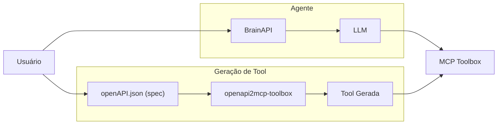
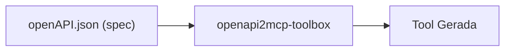

<div align="center">


# 🧠 BrainAPI – Transforme specs em respostas inteligentes

[](https://openjdk.java.net/) [](https://spring.io/projects/spring-boot) [](https://google.github.io/adk-docs/) [](https://docs.anthropic.com/en/docs/agents-and-tools/mcp) [](https://github.com/googleapis/genai-toolbox) [](https://nodejs.org/) [](https://www.docker.com/) [](https://www.openapis.org/)

</div>


## 📖 Índice

- [Visão Geral](#-visão-geral)
- [Arquitetura](#-arquitetura)
- [Pré-requisitos](#-pré-requisitos)
- [Instalação e Configuração](#-instalação-e-configuração)
- [Como Usar](#-como-usar)
- [Componentes do Sistema](#-componentes-do-sistema)
- [Exemplos Práticos](#-exemplos-práticos)
- [Estrutura do Projeto](#-estrutura-do-projeto)
- [Tecnologias](#-tecnologias)
- [Troubleshooting](#-troubleshooting)

## 🎯 Visão Geral

O **BrainAPI** é um sistema que combina Inteligência Artificial conversacional com APIs REST, permitindo que usuários interajam com APIs utilizando linguagem natural. Ao invés de fazer chamadas HTTP manuais (curl, postman, etc), você pode simplesmente perguntar:

> *"Qual o status do cartão com UUID b4ff0172-3a01-4aca-96f0-72247c5ba34c?"*

E o sistema automaticamente:
1. **Entende** sua intenção usando IA
2. **Identifica** qual API chamar
3. **Executa** a chamada HTTP apropriada
4. **Retorna** a resposta em linguagem natural

### 🌟 Principais Características

- **🗣️ Interface Natural**: Converse com APIs usando linguagem humana
- **🔄 Conversão Automática**: OpenAPI → Ferramentas MCP automaticamente
- **🤖 IA Avançada**: Powered by Google Gemini via ADK (ou qualquer outra que queira utilizar, inclusive llm locais)
- **🐳 Containerizado**: Deploy fácil com Docker
- **🌐 Interface Web**: WebServer integrado para interação
- **🔧 Extensível**: Adicione novas APIs facilmente


## 🏗️ Arquitetura

O BrainAPI é composto por três componentes principais (gerador de ferramenta, agente e mcp toolbox) que trabalham em conjunto:



### 🔄 Fluxo de Funcionamento

1. **📝 Especificação**: APIs são documentadas em formato OpenAPI
2. **⚙️ Geração**: `openapi2mcp-toolbox` converte endpoints em ferramentas MCP
3. **🚀 Hospedagem**: MCP Toolbox serve as ferramentas via protocolo MCP
4. **🧠 Processamento**: ADK Agent processa linguagem natural e chama ferramentas
5. **💬 Resposta**: Resultado é formatado em linguagem natural para o usuário

### 🧩 Componentes Detalhados

#### 1. OpenAPI → MCP Generator (`openapi2mcp-toolbox`)
- **Função**: Converte especificações OpenAPI em ferramentas MCP
- **Input**: `openapi.yaml` com definições de APIs
- **Output**: `tools.json` com ferramentas prontas para uso
- **Tecnologia**: Java + Maven

#### 2. MCP Toolbox (Docker)
- **Função**: Hospeda ferramentas via Model Context Protocol
- **Protocolo**: MCP (Model Context Protocol) da Anthropic
- **Interface**: HTTP + Server-Sent Events (SSE)
- **Tecnologia**: Docker container

#### 3. ADK Agent (Java + WebServer)
- **Função**: Interface de IA conversacional
- **Framework**: Google Agent Development Kit (ADK)
- **LLM**: Google Gemini 2.0 Flash (ou qualquer outro, inclusive llm locais)
- **Interface**: Web UI integrada

## 📋 Pré-requisitos

Antes de começar, certifique-se de ter instalado:

### 🔧 Software Necessário

| Componente | Versão Mínima | Download |
|------------|---------------|----------|
| **Java JDK** | 17+ | [OpenJDK](https://openjdk.java.net/) |
| **Maven** | 3.6+ | [Apache Maven](https://maven.apache.org/) |
| **Docker** | 20.0+ | [Docker](https://www.docker.com/) |
| **Node.js** | 16+ | [Node.js](https://nodejs.org/) |
| **Git** | 2.0+ | [Git](https://git-scm.com/) |

### 🔑 Chaves de API

- **Google AI Studio API Key**: Necessária para o ADK Agent
  - Obtenha em: [Google AI Studio](https://aistudio.google.com/)
  - Configure como variável de ambiente: `GOOGLE_API_KEY`

### ✅ Verificação do Ambiente

Execute os comandos abaixo para verificar se tudo está instalado:

```bash
# Verificar Java
java -version

# Verificar Maven
mvn -version

# Verificar Docker
docker --version

# Verificar Node.js
node --version

# Verificar Git
git --version
```

## 🚀 Instalação e Configuração

### 1️⃣ Clone do Repositório

```bash
git clone https://github.com/cesarschutz/BrainAPI.git
cd BrainAPI
```

### 2️⃣ Configuração da API Key

```bash
# Linux/macOS
export GOOGLE_API_KEY="sua-chave-do-google-ai-studio"

# Windows (PowerShell)
$env:GOOGLE_API_KEY="sua-chave-do-google-ai-studio"

# Windows (CMD)
set GOOGLE_API_KEY=sua-chave-do-google-ai-studio
```

### 3️⃣ Geração das Ferramentas MCP

```bash
# Navegar para o gerador
cd openapi2mcp-toolbox

# Compilar o projeto
mvn clean package

# Gerar tools.json
java -jar target/openapi-mcp-1.0-jar-with-dependencies.jar > ../tools.json

# Voltar ao diretório raiz
cd ..
```

### 4️⃣ Inicialização do MCP Toolbox

```bash
# Baixar imagem Docker
export VERSION=0.6.0
docker pull us-central1-docker.pkg.dev/database-toolbox/toolbox/toolbox:$VERSION

# Executar container
docker run -d -p 8080:8080 \
  -v $(pwd)/tools.json:/tools.json \
  --name BrainAPI-mcp \
  us-central1-docker.pkg.dev/database-toolbox/toolbox/toolbox:$VERSION \
  --tools-file=/tools.json
```

### 5️⃣ Verificação do MCP Toolbox

```bash
# Instalar e executar MCP Inspector
npx @modelcontextprotocol/inspector
```

- Abra: http://127.0.0.1:6274
- Configure:
  - **Transport type**: SSE
  - **URL**: http://127.0.0.1:8080/mcp/sse
- Clique em "Connect" e depois "List Tools"

### 6️⃣ Execução do ADK Agent

```bash
# Navegar para o agente
cd BrainAPI-agent

# Executar com WebServer
mvn compile exec:java "-Dexec.args=--server.port=8081 \
     --adk.agents.source-dir=src/ \
     --logging.level.com.google.adk.dev=DEBUG"
```

### 7️⃣ Acesso à Interface Web

Abra seu navegador em: **http://localhost:8081**

## 💡 Como Usar

### 🎯 Interface Web

1. **Acesse**: http://localhost:8081
2. **Digite**: Sua pergunta em linguagem natural
3. **Aguarde**: O processamento da IA
4. **Receba**: Resposta formatada

### 📝 Exemplos de Comandos

```
👤 Usuário: "Consulte o cartão com UUID b4ff0172-3a01-4aca-96f0-72247c5ba34c"
🤖 BrainAPI: Consultando cartão...
📊 Resultado: Cartão ativo, limite R$ 5.000, disponível R$ 3.750

👤 Usuário: "Qual o status do meu cartão?"
🤖 BrainAPI: Para consultar seu cartão, preciso do UUID. Você pode fornecer?
```

### 🔧 Comandos Avançados

O BrainAPI entende diversos tipos de solicitações:

- **Consultas**: "Mostre informações do cartão com uuid b4ff0172-3a01-4aca-96f0-72247c5ba34c"
- **Filtros**: "Liste cartões do customer uuid eb58556d-e468-49fe-b3b8-02220e878897"
- **Operações**: "Bloqueie o cartão b4ff0172-3a01-4aca-96f0-72247c5ba34c"
- **Relatórios**: "Gere relatório de transações do mês do cartão b4ff0172-3a01-4aca-96f0-72247c5ba34c"


## 🧩 Componentes do Sistema

### 🔧 1. OpenAPI MCP Generator

O gerador é responsável por converter especificações OpenAPI em ferramentas compatíveis com o protocolo MCP.



#### 🔄 Processo de Conversão

1. **Parsing**: Lê e valida o arquivo `openapi.json`
2. **Mapeamento**: Cada endpoint vira uma ferramenta MCP
3. **Validação**: Verifica tipos de dados e parâmetros
4. **Serialização**: Gera JSON no formato esperado pelo MCP Toolbox `tools.json`

#### 📋 Exemplo de Conversão

**Input (OpenAPI):**
```yaml
paths:
  /cards/{uuid}:
    get:
      summary: "Get card by UUID"
      parameters:
        - name: uuid
          in: path
          required: true
          schema:
            type: string
```

**Output (MCP Tool):**
```yaml
my-http-tool:
    kind: http
    source: get-card-by-uuid
    method: GET
    path: /cards/{.uuid}
    description: Get card by UUID
```

### 🛠️ 2. MCP Toolbox

O MCP Toolbox é um servidor que hospeda as ferramentas geradas e as disponibiliza via protocolo MCP.

#### 🌐 Protocolo MCP

O Model Context Protocol (MCP) é um padrão aberto criado pela Anthropic para conectar LLMs a fontes de dados e ferramentas externas.

**Características principais:**
- **Arquitetura Cliente-Servidor**: Separação clara de responsabilidades
- **Protocolo Padronizado**: Comunicação consistente entre componentes
- **Transporte Flexível**: Suporte a stdio, HTTP, e Server-Sent Events
- **Descoberta Automática**: Ferramentas são descobertas dinamicamente

#### 🔌 Endpoints Disponíveis

| Endpoint | Método | Descrição |
|----------|--------|-----------|
| `/mcp/sse` | GET | Server-Sent Events para comunicação MCP |
| `/health` | GET | Health check do serviço |
| `/tools` | GET | Lista de ferramentas disponíveis |

#### 🐳 Configuração Docker

```dockerfile
# Exemplo de configuração
FROM us-central1-docker.pkg.dev/database-toolbox/toolbox/toolbox:0.6.0

# Copiar arquivo de ferramentas
COPY tools.json /tools.json

# Expor porta
EXPOSE 8080

# Comando de inicialização
CMD ["--tools-file=/tools.json"]
```

### 🤖 3. ADK Agent

O Agent é o componente de IA que processa linguagem natural e executa as ferramentas apropriadas.

#### 🔄 Fluxo de Processamento

1. **Recepção**: Usuário envia mensagem via interface web
2. **Análise**: LLM analisa a intenção e identifica ação necessária
3. **Seleção**: Agent escolhe ferramenta MCP apropriada
4. **Execução**: Ferramenta é executada via MCP Toolbox
5. **Formatação**: Resposta é formatada em linguagem natural
6. **Entrega**: Resultado é enviado de volta ao usuário

#### 🌐 WebServer Integrado

O ADK inclui um WebServer Spring Boot integrado que fornece:

- **Interface Web**: UI para interação com o agent
- **API REST**: Endpoints para integração programática
- **WebSocket**: Comunicação em tempo real
- **Monitoramento**: Logs e métricas de performance

## 📊 Exemplos Práticos

### 🎯 Cenário 1: Consulta de Cartão

**Comando do Usuário:**
```
"Mostre as informações do cartão b4ff0172-3a01-4aca-96f0-72247c5ba34c"
```

**Processamento Interno:**
1. LLM identifica intenção: consultar cartão
2. Extrai parâmetro: UUID = "b4ff0172-3a01-4aca-96f0-72247c5ba34c"
3. Seleciona ferramenta: `get-card-by-uuid`
4. Executa chamada HTTP: `GET /cards/b4ff0172-3a01-4aca-96f0-72247c5ba34c`
5. Formata resposta em linguagem natural

**Resposta do Sistema:**
```
🔍 Consultei o cartão b4ff0172-3a01-4aca-96f0-72247c5ba34c:

📊 Status: Ativo
💳 Limite: R$ 5.000,00
✅ Disponível: R$ 3.750,00
🔒 Sem bloqueios
📅 Última transação: Hoje às 14:30
```

### 🎯 Cenário 2: Tratamento de Erros

**Comando do Usuário:**
```
"Consulte o cartão b4ff0172-3a01-4aca-96f0-72247c5ba34c"
```

**Processamento com Erro:**
1. LLM identifica intenção e parâmetro
2. Executa ferramenta `get-card-by-uuid`
3. API retorna erro 404 (cartão não encontrado)
4. Agent interpreta erro e formata resposta amigável

**Resposta do Sistema:**
```
❌ Não foi possível encontrar o cartão b4ff0172-3a01-4aca-96f0-72247c5ba34c.

💡 Possíveis causas:
• UUID incorreto ou inexistente
• Cartão pode ter sido removido do sistema
• Erro de digitação no identificador

🔍 Você pode tentar:
• Verificar o UUID correto
• Listar cartões disponíveis
• Consultar por outros critérios
```


## 📁 Estrutura do Projeto

```
BrainAPI/
├── openapi2mcp-toolbox/      # Gerador de tools.json a partir do OpenAPI
├── tools.json                # Arquivo gerado com as ferramentas
├── BrainAPI-agent/           # Agente Java com ADK + WebServer
└── docs/                     # Documentação
```

## 🛠️ Tecnologias

- 🧰 [**GenAI Toolbox (MCP) -** https://github.com/googleapis/genai-toolbox](https://github.com/googleapis/genai-toolbox)
- 🤖 [**Google ADK Java -** https://google.github.io/adk-docs/](https://google.github.io/adk-docs/)
- 🌱 [**Spring Boot -** https://spring.io/projects/spring-boot](https://spring.io/projects/spring-boot)
- 📜 [**OpenAPI 3.x -** https://www.openapis.org/](https://www.openapis.org/)
- 🐳 [**Docker -** https://www.docker.com/](https://www.docker.com/)
- 🧪 [**Node.js (para `npx inspector`) -** https://nodejs.org/pt](https://nodejs.org/pt)

### 🏗️ Framework e Linguagens

| Tecnologia | Versão | Uso | Documentação |
|------------|--------|-----|--------------|
| **Java** | 17+ | Linguagem principal | [OpenJDK](https://openjdk.java.net/) |
| **Spring Boot** | 3.x | Framework web | [Spring Boot](https://spring.io/projects/spring-boot) |
| **Maven** | 3.6+ | Gerenciamento de dependências | [Apache Maven](https://maven.apache.org/) |
| **Google ADK** | Latest | Framework de agents | [ADK Docs](https://google.github.io/adk-docs/) |

### 🤖 Inteligência Artificial

| Componente | Provedor | Modelo | Uso |
|------------|----------|--------|-----|
| **LLM** | Google | Gemini 2.0 Flash | Processamento de linguagem natural |
| **MCP** | Anthropic | Protocol v1.0 | Comunicação com ferramentas |
| **ADK** | Google | Latest | Framework de desenvolvimento |

### 🐳 Infraestrutura

| Tecnologia | Versão | Uso | Documentação |
|------------|--------|-----|--------------|
| **Docker** | 20.0+ | Containerização | [Docker](https://www.docker.com/) |
| **Docker Compose** | 2.0+ | Orquestração | [Compose](https://docs.docker.com/compose/) |
| **Nginx** | 1.20+ | Proxy reverso | [Nginx](https://nginx.org/) |

### 📡 Protocolos e APIs

| Protocolo | Versão | Uso | Especificação |
|-----------|--------|-----|---------------|
| **OpenAPI** | 3.x | Documentação de APIs | [OpenAPI](https://www.openapis.org/) |
| **MCP** | 1.0 | Comunicação com ferramentas | [MCP Docs](https://docs.anthropic.com/en/docs/agents-and-tools/mcp) |
| **HTTP/REST** | 1.1/2.0 | Comunicação entre serviços | [RFC 7231](https://tools.ietf.org/html/rfc7231) |
| **Server-Sent Events** | - | Streaming de dados | [SSE Spec](https://html.spec.whatwg.org/multipage/server-sent-events.html) |

### 🔧 Ferramentas de Desenvolvimento

| Ferramenta | Uso | Link |
|------------|-----|------|
| **IntelliJ IDEA** | IDE recomendada | [JetBrains](https://www.jetbrains.com/idea/) |
| **VS Code** | Editor alternativo | [VS Code](https://code.visualstudio.com/) |
| **Postman** | Teste de APIs | [Postman](https://www.postman.com/) |
| **MCP Inspector** | Debug de ferramentas MCP | [NPM Package](https://www.npmjs.com/package/@modelcontextprotocol/inspector) |

## 🔧 Troubleshooting

### ❌ Problemas Comuns

#### 1. Erro de Conexão com MCP Toolbox

**Sintoma:**
```
ERROR: Failed to connect to MCP server at http://localhost:8080/mcp/sse
```

**Soluções:**
```bash
# Verificar se o container está rodando
docker ps | grep BrainAPI-mcp

# Verificar logs do container
docker logs BrainAPI-mcp

# Reiniciar o container
docker restart BrainAPI-mcp

# Verificar conectividade
curl http://localhost:8080/health
```

#### 2. API Key do Google AI Studio Inválida

**Sintoma:**
```
ERROR: Authentication failed with Google AI Studio
```

**Soluções:**
```bash
# Verificar se a variável está definida
echo $GOOGLE_API_KEY

# Redefinir a variável
export GOOGLE_API_KEY="sua-chave-correta"

# Verificar validade da chave
curl -H "Authorization: Bearer $GOOGLE_API_KEY" \
     https://generativelanguage.googleapis.com/v1/models
```

#### 3. Ferramentas MCP Não Encontradas

**Sintoma:**
```
WARNING: No MCP tools found in tools.json
```

**Soluções:**
```bash
# Verificar se tools.json foi gerado
ls -la tools.json

# Regenerar tools.json
cd openapi2mcp-toolbox
mvn clean package
java -jar target/openapi-mcp-1.0-jar-with-dependencies.jar > ../tools.json

# Verificar conteúdo do arquivo
cat tools.json | jq .
```

#### 4. Porta em Uso

**Sintoma:**
```
ERROR: Port 8080 is already in use
```

**Soluções:**
```bash
# Verificar processos usando a porta
lsof -i :8080

# Matar processo específico
kill -9 <PID>

# Usar porta alternativa
mvn compile exec:java "-Dexec.args=--server.port=8081"
```

### 🔍 Debug e Logs

#### Habilitando Logs Detalhados

```bash
# ADK Agent com logs debug
mvn compile exec:java "-Dexec.args=--server.port=8080 \
     --logging.level.com.google.adk=DEBUG \
     --logging.level.com.BrainAPI=TRACE"

# MCP Toolbox com logs verbose
docker run -p 8080:8080 \
  -v $(pwd)/tools.json:/tools.json \
  -e LOG_LEVEL=DEBUG \
  us-central1-docker.pkg.dev/database-toolbox/toolbox/toolbox:$VERSION \
  --tools-file=/tools.json --verbose
```

#### Monitoramento em Tempo Real

```bash
# Logs do ADK Agent
tail -f BrainAPI-agent/logs/application.log

# Logs do MCP Toolbox
docker logs -f BrainAPI-mcp

# Monitoramento de recursos
docker stats BrainAPI-mcp
```